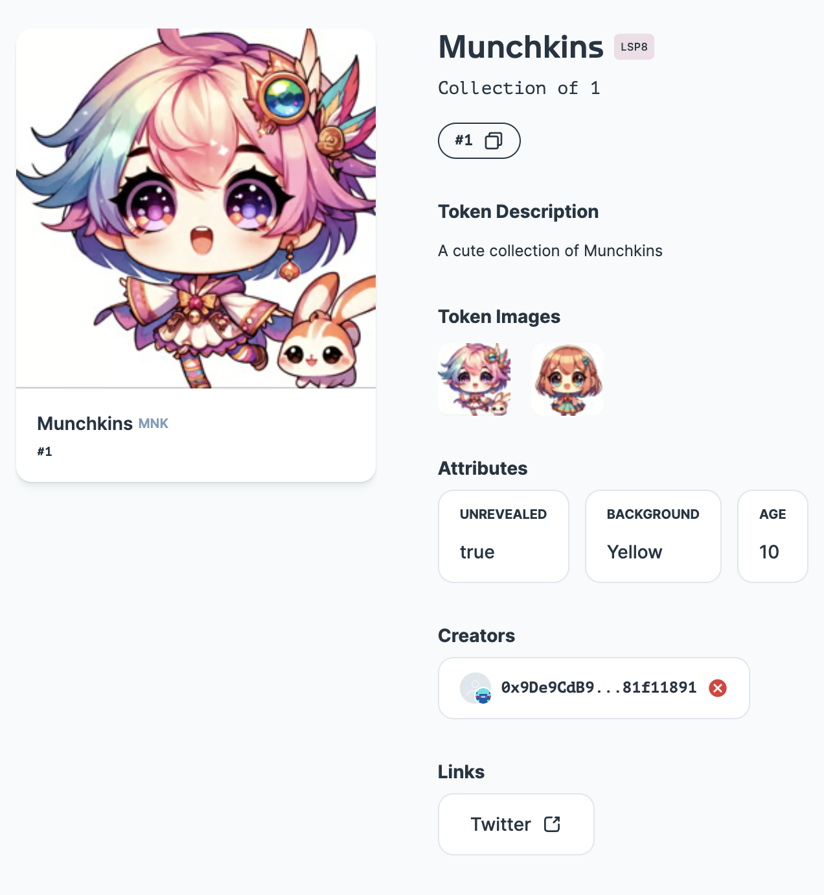

# Munchkins Collection

A cute collection of Munchkins NFTs.



## Run Locally

1. Clone the repo

   ```
   git clone https://github.com/biancabuzea200/NFT-Collection-LUKSO.git`
   ```

2. Install the dependencies

   ```
   npm install
   ```

3. Rename the .env.example file to .env and add your secrets

4. Compile the contract

   ```
   npx hardhat compile
   ```

5. Deploy the smart contract on LUKSO Testnet

   ```
   npx hardhat run scripts/deploy.ts --network lukso_testnet
   ```

6. Upload each media file (icon, pictures, etc.) to IPFS and get their CIDs, and create an LSP4 Metadata JSON file

   ```
   npx hardhat run scripts/generateMetadataJSON.ts --network lukso_testnet
   ```

7. Encode the LSP4 Metadata JSON file URL as a VerifiableURI

   ```
   npx hardhat run scripts/updateTokenIdMetadata.ts --network lukso_testnet
   ```

8. Mint your NFT
   ```
   npx hardhat run scripts/minttokenId.ts --network lukso_testnet
   ```
